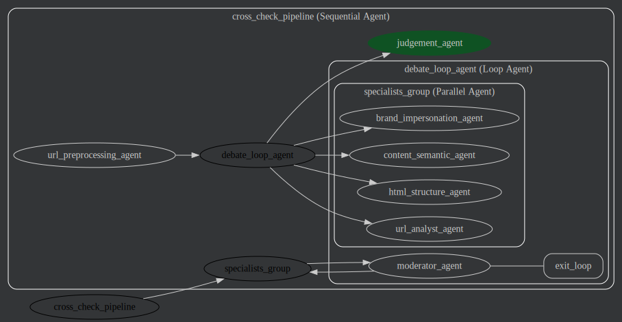

# Cross-Check 

**A Multi-Agent System for Cross-Checking Phishing URLs.**

Cross-Check is an advanced phishing detection framework powered by Large Language Models (LLMs). Built using **Google's Agent Development Kit (ADK)** and **Mesop**, it implements a "debate" mechanism where multiple specialized AI agents analyze a website from different perspectives before reaching a consensus on its legitimacy.

## Overview

Traditional phishing detection often relies on single-point analysis. Cross-Check mitigates the risk of AI hallucinations and improves accuracy by employing a **Multi-Agent Debate Framework**.

Instead of asking one model "Is this phishing?", Cross-Check convenes a panel of experts:

1.  **URL Analyst:** Examines domain patterns, typosquatting, and TLDs.
2.  **HTML Structure Analyst:** Inspects code for hidden elements, obfuscated scripts, and form exploits.
3.  **Content Semantic Analyst:** Analyzes visible text for urgency, social engineering, and manipulative language.
4.  **Brand Impersonation Analyst:** Detects mismatches between brand identity and the actual URL/content.

These agents debate their findings under the supervision of a **Moderator**, and a **Judge** delivers the final verdict.

## 🏗️ Architecture & Workflow

The system utilizes a sequential pipeline governed by a debate loop.




## 🤖 The Agentic Pipeline

Cross-Check operates on a sophisticated `SequentialAgent` architecture powered by Google ADK. The pipeline simulates a panel of cybersecurity experts debating the legitimacy of a website.

The system processes a request in three distinct stages:

### 1\. Ingestion & Preprocessing

**Agent:** `UrlPreProcessor` – Before any AI analysis occurs, this custom Python agent executes deterministic validation:

  * **Validation:** Verifies the URL format and reachability.
  * **Extraction:** Scrapes the target website, cleaning the raw HTML and extracting visible text.
  * **Context Injection:** Places the sanitized data into the session state, ensuring all subsequent agents analyze the exact same snapshot of the site.

### 2\. The Debate Loop

**Agent:** `LoopAgent` – containing a `ParallelAgent` & `Moderator`
This is the core reasoning engine. Instead of a single pass, the system enters an iterative cycle:

  * **Parallel Analysis:** Four specialist agents (`UrlAnalyst`, `HtmlAnalyst`, `ContentAnalyst`, `BrandAnalyst`) analyze the website simultaneously. Each focuses solely on its domain (e.g., the URL analyst looks for typosquatting, while the HTML analyst looks for obfuscated scripts).
  * **Moderator Review:** The `ModeratorAgent` aggregates the specialists' outputs. It evaluates if a consensus exists.
  * **Dynamic Flow:**
      * If the team agrees, the Moderator calls the `exit_loop` tool to break the cycle.
      * If there is disagreement (e.g., URL looks fine but Content is suspicious), the Moderator triggers another round, forcing agents to re-evaluate based on peer feedback.

### 3\. Final Judgment

**Agent:** `JudgementAgent` – Once the debate concludes (either via consensus or reaching the maximum iteration limit), the Judge reviews the entire conversation history. It weighs the final arguments from all specialists and delivers the authoritative `PHISHING` or `LEGITIMATE` verdict.

## ✨ Features

  * **Google ADK Integration:** Scalable and modular agent orchestration.
  * **Mesop UI:** A clean, Python-native web interface.
  * **Model Agnostic:** Uses **LiteLLM** to route requests to models like Llama 3, GPT-4, or Gemini.
  * **Debate Capability:** Implements multi-round reasoning to reduce false positives.
  * **Robust Evaluation:** Integrated Pytest suite for benchmarking and unit testing.

## 🚀 Getting Started

### Prerequisites

  * Python 3.13+
  * `uv` (for fast Python package management)
  * API Keys for your LLM provider (e.g., Groq, OpenAI)

### Installation

1.  **Clone the repository:**

    ```bash
    git clone https://github.com/vksundararajan/cross-check.git
    cd cross-check
    ```

2.  **Install dependencies:**

    ```bash
    make install
    ```

3.  **Environment Setup:**
    Rename the example environment file and add your API keys.

    ```bash
    mv .env.example .env
    # Edit .env and add your GROQ_API_KEY or relevant model keys
    ```

### Running the Application

You can run the application using the provided Makefile or via Docker.

**Using Make:**
To see all available commands (including tests, evaluation, and dev server), simply run:

```bash
make help
```

To start the web UI immediately:

```bash
make serve
```

**Using Docker:**

```bash
docker build -t cross-check .
docker run -p 9200:9200 -e GROQ_API_KEY=$GROQ_API_KEY cross-check
```

## 📚 Reference

> **PhishDebate: An LLM-Based Multi-Agent Framework for Phishing Website Detection**  
> *Wenhao Li, Selvakumar Manickam, Yung-Wey Chong, Shankar Karuppayah*  
> [arXiv:2506.15656 [cs.CR]](https://arxiv.org/abs/2506.15656)

## 📄 License

This project is licensed under the MIT License - see the [LICENSE](LICENSE) file for details.